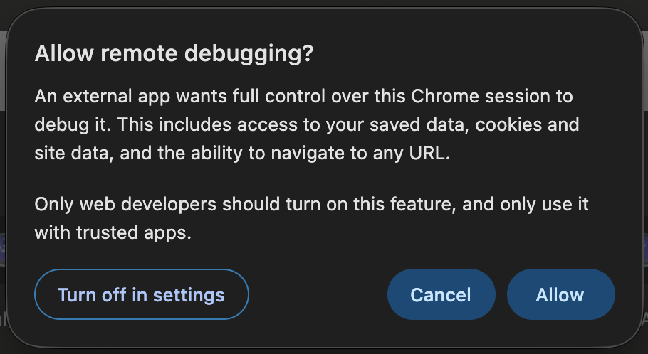

# Chrome DevTools MCP Auto-Allow for macOS

Automatically clicks Chrome's "Allow remote debugging?" dialog when Chrome DevTools MCP connects with `--autoConnect`.

This uses [Hammerspoon](https://www.hammerspoon.org/) and macOS Accessibility automation. It does not disable Chrome's permission prompt; it watches for the dialog and presses the visible `Allow` button.



## Security warning

This script automatically approves Chrome remote debugging prompts. Only use it on a trusted machine, with trusted MCP clients. Remote debugging can give another local process broad control over the browser session.

## Requirements

- macOS
- Hammerspoon
- Accessibility permission granted to Hammerspoon
- Chrome, Chrome Beta, Chrome Canary, or Chromium
- English Chrome UI

## Install

1. Install and open Hammerspoon.
2. Grant Hammerspoon Accessibility access in `System Settings > Privacy & Security > Accessibility`.
3. Copy `init.lua` into `~/.hammerspoon/init.lua`, or paste its contents into your existing Hammerspoon config.
4. Reload Hammerspoon config.

When Chrome shows the remote debugging approval dialog, the script scans Chrome's accessibility tree and presses `Allow`.

It polls running Chrome windows every 0.5 seconds, so the click usually happens shortly after the dialog appears.

The polling timer is stored globally so Hammerspoon keeps it alive after the config finishes loading.

You can also trigger a manual scan with:

```text
Ctrl + Option + Command + D
```

## Chrome DevTools MCP

This is useful when running Chrome DevTools MCP with `--autoConnect`, where Chrome asks the user to approve the remote debugging connection.

If you control the browser launch yourself, a dedicated debugging profile with `--remote-debugging-port` and MCP `--browserUrl` may be cleaner. This script is meant for the case where you want to keep using Chrome's interactive approval flow but remove the repetitive click.

## Troubleshooting

Open the Hammerspoon Console and check for logs:

```text
Chrome DevTools auto-allow script loaded
Matched remote debugging dialog
Pressing Allow
```

If the dialog is detected but the button is not pressed, run `debug-dialogs.lua` in the Hammerspoon Console while the dialog is visible to inspect native Chrome dialog containers. Then run `debug-press.lua` to inspect the matched `Allow` button and test `AXPress`.

Chrome may expose button text through `AXDescription` instead of `AXTitle`. The included script checks both, plus `AXValue` and `AXHelp`.

## Tested With

- macOS
- Google Chrome
- Hammerspoon
- Chrome DevTools MCP `--autoConnect`

## License

MIT
